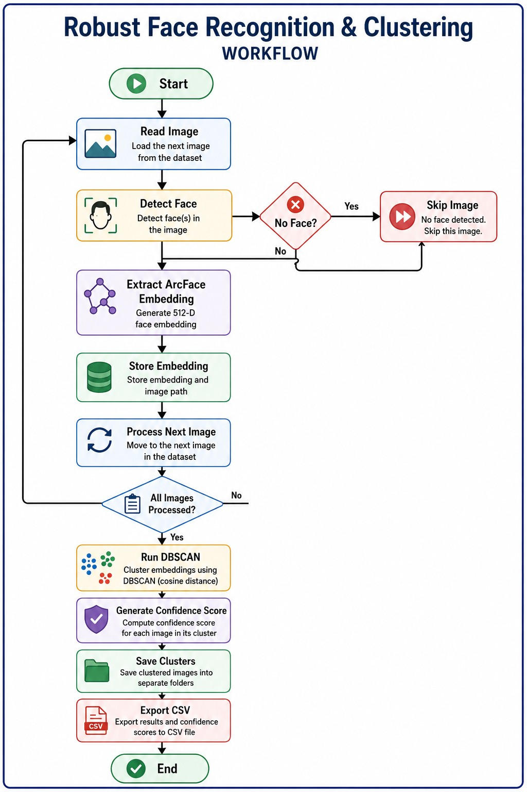

# Face Identification and Clustering 

> A Computer Vision pipeline that automatically groups images of the same individual under varying lighting conditions, facial expressions, and viewing angles using ArcFace embeddings and DBSCAN clustering.

---

## Overview


The objective is to automatically identify images belonging to the same person without prior knowledge of the number of individuals present in the dataset.

The pipeline extracts robust facial embeddings using **InsightFace (ArcFace)** and clusters similar identities using **DBSCAN** with cosine distance. A confidence score is also assigned to every clustered image based on its similarity to the cluster representation.

---

## Problem Statement

Given an unorganized collection of facial images captured under different environmental conditions, automatically:

- Detect faces
- Identify images belonging to the same individual
- Group them into separate clusters
- Assign a confidence score for every clustered image
- Generate an organized output along with a CSV report

---

## Features

- Face Detection using InsightFace
- ArcFace (512-dimensional) face embeddings
- Automatic identity clustering using DBSCAN
- Cosine distance based similarity measurement
- Confidence score estimation
- Automatic cluster folder generation
- CSV report containing image, cluster ID and confidence

---

## System Architecture

<p align="center">

</p>

---

## Workflow

<p align="center">

</p>

---

## Project Structure

```text
Face-Identification-ArcFace-DBSCAN/
│
├── assets/
│   ├── architecture.png
│   ├── workflow.png
│   └── output.png
│
├── sample_output/
│   ├── cluster_0/
│   ├── cluster_1/
│   ├── cluster_2/
│   └── report.csv
│
├── Face_Identification.ipynb
├── requirements.txt
├── README.md
└── LICENSE
```

---

## Tech Stack

| Category | Tools |
|----------|-------|
| Language | Python |
| Development | Google Colab |
| Computer Vision | InsightFace, OpenCV |
| Face Recognition | ArcFace |
| Machine Learning | Scikit-learn (DBSCAN) |
| Data Processing | NumPy, Pandas |
| Visualization | Matplotlib |
| Utilities | tqdm |

---

## Processing Pipeline

```text
Input Dataset
      │
      ▼
Read Images
      │
      ▼
Face Detection (InsightFace)
      │
      ▼
Extract ArcFace Embeddings
      │
      ▼
DBSCAN Clustering
      │
      ▼
Compute Confidence Score
      │
      ▼
Generate Cluster Folders
      │
      ▼
Export CSV Report
```

---

## Why ArcFace?

ArcFace generates highly discriminative 512-dimensional facial embeddings that remain consistent despite variations in:

- Lighting
- Facial expression
- Camera angle
- Minor occlusions

Instead of comparing raw pixel values, the system compares these learned feature representations.

---

## Why DBSCAN?

Unlike K-Means, DBSCAN does not require the number of identities beforehand.

It was selected because it:

- Automatically discovers clusters
- Handles unknown number of individuals
- Identifies outliers (noise)
- Works effectively with cosine distance on normalized embeddings

---

## Confidence Score

DBSCAN only assigns cluster labels and does not provide confidence values.

To estimate confidence:

1. Compute the centroid of each cluster.
2. Measure cosine similarity between every embedding and its cluster centroid.
3. Convert the similarity into a confidence percentage.

Higher similarity indicates a stronger likelihood that the image belongs to the assigned identity.

---

## Output

The pipeline automatically creates the following structure:

```text
output_clusters/

cluster_0/
    image1.jpg
    image2.jpg

cluster_1/
    image3.jpg
    image4.jpg

cluster_2/
    image5.jpg
    image6.jpg

report.csv
```

Example CSV:

| Image | Cluster | Confidence |
|--------|----------|------------|
| person_01_0.jpg | 0 | 91.80% |
| person_01_1.jpg | 0 | 91.80% |
| person_02_0.jpg | 1 | 88.29% |

---

## Sample Output

<p align="center">

</p>

---

## Installation

Clone the repository.

```bash
git clone https://github.com/yourusername/Face-Identification-ArcFace-DBSCAN.git
```

Install the required packages.

```bash
pip install -r requirements.txt
```

---

## Running the Project

1. Open the notebook in Google Colab.
2. Upload the dataset ZIP file.
3. Run all notebook cells sequentially.
4. The pipeline will:
   - Detect faces
   - Extract embeddings
   - Perform clustering
   - Calculate confidence scores
   - Generate clustered folders
   - Export the CSV report

---

## Limitations

- Designed for images containing one primary face.
- Images with no detectable face are skipped.
- Images containing multiple faces currently use the largest detected face.
- Single-image identities may be classified as noise when `min_samples = 2`.
- DBSCAN parameters may require tuning for significantly different datasets.

---

## Future Improvements

- Multi-face image support
- Automatic DBSCAN parameter optimization
- Embedding caching
- Real-time webcam inference
- Streamlit web application
- FAISS indexing for large-scale datasets

---

## References

- InsightFace
- ArcFace
- OpenCV
- Scikit-learn DBSCAN

---

## Author

**Prajjval Pawar**
